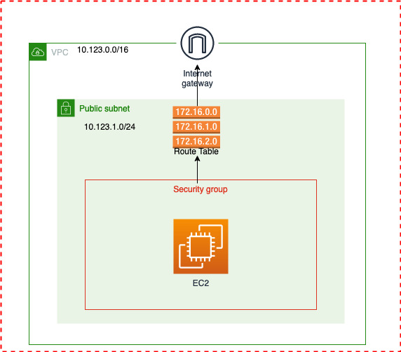

# Terraform project for beginners 
> Learn Terraform by performing this small project 

Learn Terraform basics as you utilize Visual Studio Code (On Windows, Mac, or Linux!) to deploy AWS resources and an EC2 instance that you can SSH into to have your own re-deployable environment.

In this project we will learn how to

- Create a VPC
- Create EC2 instance
- Install Docker in EC2

all using terraform.  


Following architecture diagram will be helpful to understand.



To understand more about AWS networking [Click Here](https://awsmag.com/aws-networking-fundamentals/)

**Topics**
1. Setup Terraform and AWS
2. Setup Project folder
3. Create VPC
4. Create EC2 instance


## Setup Terraform and AWS

As a first step we need to have terraform installed and able to connect to AWS. Follow this [hashicorp](https://learn.hashicorp.com/tutorials/terraform/install-cli) document to install terraform on your PC/laptop.

### AWS Credential Setup

First, setup your AWS credentials locally by following the steps [here](https://docs.aws.amazon.com/sdk-for-java/v1/developer-guide/setup-credentials.html)

If configured correct, you should be able to run a simple command such as `aws s3 ls` to list our your S3 buckets (*should return nothing if using an brand new empty account*). You can also view your configured credentials by running `cat ~/.aws/credentials`


## Setup Project folder

Create a folder (*e.g `terraform-practice-project`*) to place the terraform files. Create a file named `main.tf` and open it on your favorite editor.

## Create VPC

Before we start writing code to create VPC, we need to inform terraform about the cloud providers and versions which we are going to use. So create a file `provider.tf`

>  **Provider**
> 
> Terraform relies on plugins called "providers" to interact with cloud providers, SaaS providers, and other APIs.
> Terraform configurations must declare which providers they require so that Terraform can install and use them. In the following code we have used AWS as provider. 

```
terraform {
  required_providers {
    aws = {
      source  = "hashicorp/aws"
      version = "~> 3.0"
    }
  }
}

// you can change your authentication system as per your needs
// https://registry.terraform.io/providers/hashicorp/aws/latest/docs
provider "aws" {
  region                  = "us-east-2"
  shared_credentials_file = "~/.aws/credentials"
  profile                 = "personal"
}
```

Now lets create the VPC. Create a file `main.tf` and the following resource block.

```
// Create VPC
resource "aws_vpc" "lab_vpc" {
  cidr_block           = "10.123.0.0/16"
  enable_dns_hostnames = true
  enable_dns_support   = true

  tags = {
    Name = "lab"
  }
}
```

Public Subnets are small pockets in each availability zone that can be accessed via the internet directly, Add this subnet block on the `main.tf`

```
resource "aws_subnet" "lab_public_subnet" {
  vpc_id                  = aws_vpc.lab_vpc.id
  cidr_block              = "10.123.1.0/24"
  map_public_ip_on_launch = true
  availability_zone       = "us-east-2a"

  tags = {
    Name = "lab-public"
  }
}
```

Our EC2 instance need to talk to internet, so we will add a Internet Gateway to our VPC

```JSON
resource "aws_internet_gateway" "lab_igw" {
  vpc_id = aws_vpc.lab_vpc.id

  tags = {
    Name = "lab-igw"
  }
}
```

Now create a route table and associate the subnet to IGW 

```
resource "aws_route_table" "lab_public_route_table" {
  vpc_id = aws_vpc.lab_vpc.id

  tags = {
    Name = "lab-rt"
  }
}

resource "aws_route" "default_route" {
  route_table_id         = aws_route_table.lab_public_route_table.id
  destination_cidr_block = "0.0.0.0/0"
  gateway_id             = aws_internet_gateway.lab_igw.id
}

resource "aws_route_table_association" "lab_public_assoc" {
  subnet_id      = aws_subnet.lab_public_subnet.id
  route_table_id = aws_route_table.lab_public_route_table.id
}
```

create a security group to allow access to our EC2 instance.

```
resource "aws_security_group" "lab_sg" {
  name        = "dev-sg"
  description = "dev security group"
  vpc_id      = aws_vpc.lab_vpc.id

  ingress {
    from_port   = 0
    to_port     = 0
    protocol    = "-1"
    cidr_blocks = ["0.0.0.0/0"] // This will allow access to public. Changing to your PC/Laptop public IP is recommended.
  }

  egress {
    from_port   = 0
    to_port     = 0
    protocol    = "-1"
    cidr_blocks = ["0.0.0.0/0"]
  }
}
```

## Create EC2 instance

We have written terraform to create VPC, now lets work on creating a EC2 instance withing that VPC. 

Considering our AWS account is new so we will create a new key-pair. If need more information on creating a key-pair on your Windows [Click Here](https://phoenixnap.com/kb/generate-ssh-key-windows-10)

```
resource "aws_key_pair" "lab_auth" {
  key_name   = "labkey"
  public_key = file("~/.ssh/labkey.pub")
}
```

we want an EC2 instance with following configuration

- Instance Type = t2.micro
- OS = Ubuntu 18.04 
- software installed = Docker

since we alway want to use the latest AMI, we will create a data block to pull the latest AMI details. 

> **Data sources** allow Terraform to use information defined outside of Terraform, defined by another separate Terraform configuration, or modified by functions.

```
data "aws_ami" "server_ami" {
  most_recent = true
  owners      = ["099720109477"] // ubuntu

  filter {
    name   = "name"
    values = ["ubuntu/images/hvm-ssd/ubuntu-bionic-18.04-amd64-server-*"]
  }
}
```
we will map this datasource to the ec2 resource block

One of the other requirement is to install Docker when the EC2 instance was provisioned. To achieve this we need to write a user data block as a template 

Create a `userdata.tpl` file enter this bash script.
```sh
#!/bin/bash
sudo apt-get update -y &&
sudo apt-get install -y \
apt-transport-https \
ca-certificates \
curl \
gnupg-agent \
software-properties-common &&
curl -fsSL https://download.docker.com/linux/ubuntu/gpg | sudo apt-key add - &&
sudo add-apt-repository "deb [arch=amd64] https://download.docker.com/linux/ubuntu $(lsb_release -cs) stable" &&
sudo apt-get update -y &&
sudo apt-get install docker-ce docker-ce-cli containerd.io -y &&
sudo usermod -aG docker ubuntu
```

finally lets create the EC2 instance. withing the `main.tf` add the ec2 resource block.

```
// Create EC2 instance
resource "aws_instance" "lab_node" {
  instance_type          = "t2.micro"
  ami                    = data.aws_ami.server_ami.id
  key_name               = aws_key_pair.lab_auth.id
  vpc_security_group_ids = [aws_security_group.lab_sg.id]
  subnet_id              = aws_subnet.lab_public_subnet.id
  user_data              = file("userdata.tpl")

  root_block_device {
    volume_size = 10
  }

  tags = {
    Name = "lab-node"
  }

// below mentioned block will create a VSCode config file, which will provide ec2 access to vscode
// this is OPTIONAL
  provisioner "local-exec" {
    command = templatefile("${var.host_os}-ssh-config.tpl", {
      hostname     = self.public_ip
      user         = "ubuntu"
      identityfile = "~/.ssh/labkey"
    })
    // This script was default to Windows 
    // IF using linux/macos use
    // terraform apply -var="host_os=linux"
    interpreter = var.host_os == "windows" ? ["powershell", "-command"] : ["bash", "-c"]
  }

}
```

Once the EC2 instance is created we need to know the public IP to connect. So we will create a output block on `output.tf` file to print the public IP of EC2.

```
output "dev_public_ip" {
  value = aws_instance.lab_node.public_ip
}
```

Also create a `variable.tf` file if using the VSCode config file. (These are completely optional)
```
variable "host_os" {
  type    = string
  default = "windows"
}
```
and `windows-ssh-config.tpl` for vscode configure

```
add-content -path '~\.ssh\config' -value @'

Host ${hostname}
    HostName ${hostname}
    User ${user}
    IdentityFile ${identityfile}
'@
```

OK... enough writing code. Lets rollout

Initialize terraform 

```
terraform init
```

Format your using 

```
terraform fmt
```

at last lets plan and apply

```
terraform plan

terraform apply
```

This whole terraform code can be found at my [GitHub repo](https://github.com/JAG-010/terraform-practice-project)
